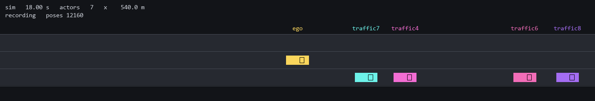

# continuo

A deterministic simulation orchestration system in Rust. A conductor advances
a world while components set their own cadence and join or leave throughout,
enabling many-actor scenarios such as live traffic around an autonomous
vehicle. It runs entirely in a single process today, and is designed so
components can later be split into separate processes over
[Zenoh](https://zenoh.io/) without changing component code.



See [PLAN.md](PLAN.md) for the full design and milestone roadmap, and
[DECISIONS.md](DECISIONS.md) for why the design is what it is.

## Architecture

### The conductor owns time; components own state

continuo is a discrete-event, lockstep co-simulation (the conductor plays the
role of an FMI master algorithm). There is no global tick rate: every
component reports the next sim time it should step, and the conductor advances
sim time to the earliest due time, steps exactly the components due at that
instant, and repeats.

```
            ┌──────────────────────────┐
            │        Conductor         │   owns sim time + event schedule
            │ (advance to earliest due │
            │  time, step, barrier)    │
            └────────────┬─────────────┘
             TickStart   │   TickDone { next_due }
            ┌────────────┴─────────────┐
            │        Transport         │   pub/sub on key expressions,
            │   (InProc now, Zenoh     │   e.g. continuo/demo/actor/ego/pose
            │    later; same trait)    │
            └────────────┬─────────────┘
       ┌─────────────┬───┴──────────┬──────────────────┐
┌──────┴─────┐ ┌─────┴──────┐ ┌─────┴─────────┐ ┌──────┴─────┐
│    ego     │ │  traffic7  │ │traffic_spawner│ │   logger   │ world-level
│ ┌────────┐ │ │ ┌────────┐ │ │    (2 Hz)     │ │   (1 Hz)   │ actors
│ │  ctrl  │ │ │ │  ctrl  │ │ └───────┬───────┘ └────────────┘
│ ├────────┤ │ │ ├────────┤ │         │
│ │physics │ │ │ │physics │ │         │ watches poses, asks for cars
│ └────────┘ │ │ └────────┘ │         │ to be added and removed
└────────────┘ └────────────┘         ▼
  composites: ordered children,     traffic joins and leaves while
  intra-step pipeline               the run is under way
```

### Key ideas

- **Self-scheduled stepping.** `Component::step` returns its own `next_due`
  time. Fixed periods, aperiodic sensors, and event-driven components all use
  the same mechanism. A component must always schedule strictly into the
  future (≥ 1 ns); the conductor rejects zero-time livelock.
- **Integer-nanosecond time.** `SimTime` is `i64` nanoseconds internally and
  exact decimal seconds on the wire (`1.234567891`), formatted and parsed via
  integer math only. Scheduling comparisons are integer, so there are no
  float-equality hazards.
- **Hierarchical components.** Actors are composites of ordered
  sub-components (e.g. `controller → physics`). The visibility rule makes the
  hierarchy meaningful:
  - *Across actors:* a message published at time T is seen at the consumer's
    next step after T. Co-due actors never see each other's same-instant
    outputs, which is the lockstep isolation that makes distribution possible.
  - *Inside a composite:* children step in declared order, and messages from
    an earlier child reach later children in the same step, giving the
    sensor → controller → physics pipeline.
- **Deterministic by construction.** Inboxes are sorted by
  `(publisher, seq)`, never arrival order; execution order within an instant
  is declaration order; no wall clock or OS entropy in sim logic. All
  randomness derives from one world seed. `HashMap` and `HashSet` are banned
  workspace-wide by a clippy lint, since their iteration order is
  unspecified; every map here is a `BTreeMap`.
- **Determinism verification.** Every tick the conductor emits a
  **fingerprint**, a hash over what each stepped component published (plus
  its internal state, if it implements `state_bytes`), chained into a
  running world hash, so one value fingerprints a whole run. Runs record to
  a JSON-lines event log, which can then be read two opposite ways:
  **verification** re-runs everything live and checks it against the log,
  stopping at the first divergence (divergence = broken determinism);
  **open-loop resimulation** plays recorded publishers back as stimulus for
  changed components (divergence = the experiment's result).
- **Human-readable messaging.** Every payload is canonical JSON. Time is
  decimal seconds; poses are named-field vectors and quaternions (never
  arrays); the wire format is directly inspectable and, later, hashable.
- **Pacing is one setting.** `Pacing::FreeRun` runs as fast as possible;
  `Pacing::RealTime { .. }` waits for 1x wall time and logs overruns (when
  the sim can't keep up the wall anchor slips, with no catch-up and no
  skipped steps; lateness under the re-anchor threshold is absorbed rather than
  counted). Sim logic never sees which mode is active, and pacing never
  changes the world hash.

### Crates

| Crate | Contents |
| ----- | -------- |
| [`continuo-core`](crates/continuo-core/) | `SimTime`/`SimDuration`, ids and paths, key expressions, `Vec3`/`Quat`/Euler (canonical Z-Y-X conversions), wire messages, the `Component` trait, owned hash/random/seed derivation |
| [`continuo-transport`](crates/continuo-transport/) | `Transport` trait, deterministic `InProcTransport`, `MonitorTransport` for out-of-band message recording |
| [`continuo-conductor`](crates/continuo-conductor/) | Registry (component tree as data), event schedule, the conductor loop, tick fingerprints, and the event log: `record`, `verify`, `playback` |
| [`continuo-actors`](crates/continuo-actors/) | Sample components: waypoint path, path-follow controller, unicycle physics, pose logger, traffic spawner |
| [`continuo-viz-bridge`](crates/continuo-viz-bridge/) | Relays a run's published messages and membership changes to a live viewer, as a transport monitor rather than a component |
| [`continuo-fmi`](crates/continuo-fmi/) | Runs an imported FMI 3.0 Co-Simulation FMU as a component, wired to the world by a mapping rather than by code |
| [`continuo-examples`](crates/continuo-examples/) | Runnable example worlds: `traffic` (base demo), `traffic_realtime`, `traffic_record`, `traffic_verify`, `traffic_resim`, `traffic_viz`, `traffic_scale` |
| [`python/continuo_viz`](python/) | The viewer: reads a recorded log or a live Zenoh session, and draws the world top-down |

### Milestones

See PLAN.md for what each one covers.

- [x] **M1** skeleton: core types, transport, conductor loop, traffic demo
- [x] **M2** determinism harness: seeding, tick fingerprints, event-log
      recording, verification, open-loop resimulation
- [x] **M3** real-time pacing (1x wall time, overrun logging)
- [x] **M4** runtime join/leave; per-component step budgets and timeout
      policy
- [x] **M5** visualization: a viz bridge on the transport, and a Python
      viewer for live runs and recordings
- [ ] **M6** FMI 3.0 CS import (FMUs as components)
- [ ] **M7** Zenoh transport and distributed hosts

Everywhere current code is a placeholder for later work, a comment marks the
spot: `TODO(Mn)` for numbered milestones, `TODO(PLAN "section")` for design
items tracked in PLAN.md. `grep -rn "TODO(" crates/ python/continuo_viz/`
lists them all.

## Usage

Requires a recent stable Rust toolchain (edition 2024, rust ≥ 1.85) and
libclang, the workspace's only native-code prerequisite. See
[Installing libclang](#installing-libclang) below.

```sh
# Build everything
cargo build --workspace

# Run all tests (unit + scheduling/visibility semantics + determinism)
cargo test --workspace

# Lint / format
cargo clippy --workspace --all-targets
cargo fmt --all

# Run the demo: an ego car on a straight highway, traffic spawning ahead of
# it and retiring once passed; free-run, 30 sim-seconds
cargo run -p continuo-examples --example traffic

# The same world paced to 1x real time (argument = sim-seconds to run;
# add `precise` for sleep-then-spin sub-millisecond pacing)
cargo run -p continuo-examples --example traffic_realtime -- 3

# Record the run's event log (messages + tick fingerprints)
cargo run -p continuo-examples --example traffic_record -- run.jsonl

# Determinism verification: re-run everything live, checking each event
# against the log as it happens; stops and exits non-zero at the first
# divergence
cargo run -p continuo-examples --example traffic_verify -- run.jsonl

# Open-loop resimulation: a live ego driven against played-back traffic.
# Change the ego and see what it does to the same recorded scene
# (nothing is compared)
cargo run -p continuo-examples --example traffic_resim -- run.jsonl

# What a world costs as it grows: the demo's size against a scaled one.
# Release, because a debug build measures the optimiser
cargo run --release -p continuo-examples --example traffic_scale
```

The demo logs every live car's pose once per sim-second and finishes in a
fraction of a wall-second. Traffic appears as it is spawned, so the roll
changes as the run goes on:

```
INFO initial pose sim_time=0.0 key="continuo/demo/actor/ego/pose" x=0.00 y=0.00 yaw_deg=0.0
INFO initial pose sim_time=0.5 key="continuo/demo/actor/traffic1/pose" x=80.36 y=-3.50 yaw_deg=0.0
...
INFO pose sim_time=4.0 key="continuo/demo/actor/ego/pose" x=120.00 y=0.00 yaw_deg=0.0
INFO pose sim_time=4.0 key="continuo/demo/actor/traffic1/pose" x=145.38 y=-3.50 yaw_deg=0.0
INFO pose sim_time=4.0 key="continuo/demo/actor/traffic2/pose" x=190.87 y=-3.50 yaw_deg=0.0
...
done: world 'demo' reached sim time 30.0 in 3031 ticks (free-run)
actual time: 0.404 s (74x real-time), world hash d747a81be039c5f1
```

The ego holds the centre lane at 30 m/s; traffic runs 16-22 m/s in the lanes
either side, so the ego spends the run overtaking. Nothing here models a
collision, which is why traffic never shares the ego's lane. A car is
retired once it falls 60 m behind, and a replacement spawns ahead. Over
30 sim-seconds fourteen different cars pass through a world that holds six
at a time, eight of them retired along the way.

The world hash is the run's determinism fingerprint: identical for every run
of the same seeded scenario. CI checks it against a written-down value on four
agents, covering two architectures and three libm implementations (x86_64 and
arm64, with glibc, the MSVC CRT, and Apple's), and they agree.

That is a test rather than a guarantee. IEEE 754 does not require correct
rounding for the trigonometry every pose depends on, so a new target or a
future toolchain could still disagree. What changed is that it would fail
where it happened instead of passing unnoticed. PLAN.md tracks the rest.

Two observer details worth knowing: log lines carry the *message's* sim time
(an observer is a world-level actor, so it receives time-T poses strictly
after T, which is next-step visibility), and the logger schedules its samples
**1 ns after** each second boundary, the smallest offset that clears same-instant
deferral, so on-boundary poses are visible and nothing can be scheduled
between a boundary and its sample.

### Installing libclang

The FMI importer's `fmi-sys` dependency runs `bindgen` over the FMI 3.0 C
headers at build time, so **libclang** has to be present. Without it,
`cargo build` fails in `fmi-sys` with bindgen's own message about not finding
it.

A C compiler is not enough on its own: bindgen wants the libclang shared
library, so MSVC alone does not satisfy it. Bindgen's own
[requirements page][bindgen-req] lists the package for each platform and is
the place to look first.

Two things that page does not cover:

- On Windows, Visual Studio can supply libclang, but not by default. It is the
  optional **C++ Clang Compiler for Windows** component, ticked under Desktop
  development with C++ in the installer, and bindgen does not look there on
  its own, so that route also needs `LIBCLANG_PATH` pointing at the
  `VC\Tools\Llvm\x64\bin` directory inside the Visual Studio install.
- CI installs nothing. Every GitHub runner image in the matrix ships LLVM,
  which the build itself checks on all four rather than assuming.

[bindgen-req]: https://rust-lang.github.io/rust-bindgen/requirements.html

### Watching a run

The viewer is a Python package in [`python/`](python/), installed the ordinary
way. `uv.lock` is committed for anyone who uses [uv](https://docs.astral.sh/uv/),
but nothing requires it and CI installs with plain `pip`.

```sh
cd python
python -m venv .venv
. .venv/bin/activate          # Windows: .venv\Scripts\activate
pip install -e .

# Replay a recording, paced against the sim times in it
python -m continuo_viz --log ../run.jsonl

# Fold a whole log into a scene and print what it found, drawing nothing.
# This is what CI runs, since it needs no display
python -m continuo_viz --log ../run.jsonl --check
```

Watching a live run takes two terminals. The world in one:

```sh
cargo run -p continuo-examples --example traffic_viz -- 30
```

and the viewer in the other, which watches a live world when given no log:

```sh
python -m continuo_viz
```

To record rather than watch, `--record` writes an animated GIF, which is how
the picture at the top of this file was made:

```sh
python -m continuo_viz --log ../run.jsonl --record ../docs/viewer.gif
```

Recording opens no window and does not use the wall clock: it walks the log in
fixed sim-time steps, so the same log gives the same clip on any machine, and a
slow encoder makes the recording take longer rather than making the animation
stutter. `--record-from` chooses where in the run to begin, and
`--record-seconds` and `--record-fps` set the length and smoothness.

The viewer draws a strip of road that follows one car, on a uniform scale so
lane changes read honestly rather than shearing. It is deliberately outside
the simulation: nothing it does can perturb a run, which is the same reason
the Rust side observes the transport instead of joining the world as a
component. `--verbose` reports anything it could not read.

### Observing vs. recording

There are two distinct ways to watch a world, and the demo uses both:

- **In-simulation observers** (like `PoseLogger`) are ordinary components:
  they subscribe, they step, and they see messages under the visibility rule
  like any participant. Use these when the observation is part of the world.
- **Transport monitors** (`MonitorTransport`) wrap the transport and invoke
  a callback for every published message at publish time, independent of
  subscriptions and visibility, including messages nobody subscribes to.
  Use these for logging, debugging, and recording; the milestone 2 event log
  and record/replay build on this. A monitor is not part of the simulation
  and must never feed data back into components.

Each car is a composite of two components: a `PathFollowController` (100 ms
period) that reads the car's pose and publishes a drive command, and a
`UnicyclePhysics` (10 ms period) that integrates the latest command
(sample-and-hold) and publishes the pose. The controller is declared first,
so when both are due at the same instant its command reaches the physics in
that same step; everything crossing actor boundaries (e.g. poses to the
logger) is seen next step.

## Writing a component

```rust
use continuo_core::{
    Component, ComponentId, CoreError, KeyExpr, SimDuration, SimTime, StepCtx,
};

struct Beacon;

impl Component for Beacon {
    fn id(&self) -> ComponentId {
        ComponentId::new("beacon").unwrap()
    }

    fn subscriptions(&self) -> Vec<KeyExpr> {
        vec![] // or e.g. KeyExpr::new("continuo/*/actor/*/pose").unwrap()
    }

    fn step(&mut self, ctx: &mut StepCtx) -> Result<SimTime, CoreError> {
        // read ctx.inbox(), publish via ctx.publish(key, &value)
        Ok(ctx.now() + SimDuration::from_millis(500)) // next due time
    }
}
```

Returning `Err` halts the world, and is how a component says it cannot do its
job: a payload it cannot read, a value it cannot publish. Both
`ctx.publish(..)` and `message.decode::<T>()` return the same error type, so
the usual shape is `?`. That is safe to make fatal because such a failure is a
pure function of the component's logic and the sim state, so it reproduces at
the same instant on every machine. A component that genuinely tolerates an
unreadable message matches on the `Result` and says so.

Register it with a conductor (`WORLD_LEVEL` for a world-level actor, or a
composite name to make it a child):

```rust
use continuo_conductor::WORLD_LEVEL;

conductor.add_component(WORLD_LEVEL, Box::new(Beacon))?;
```

## License

MIT. See [LICENSE](LICENSE).
